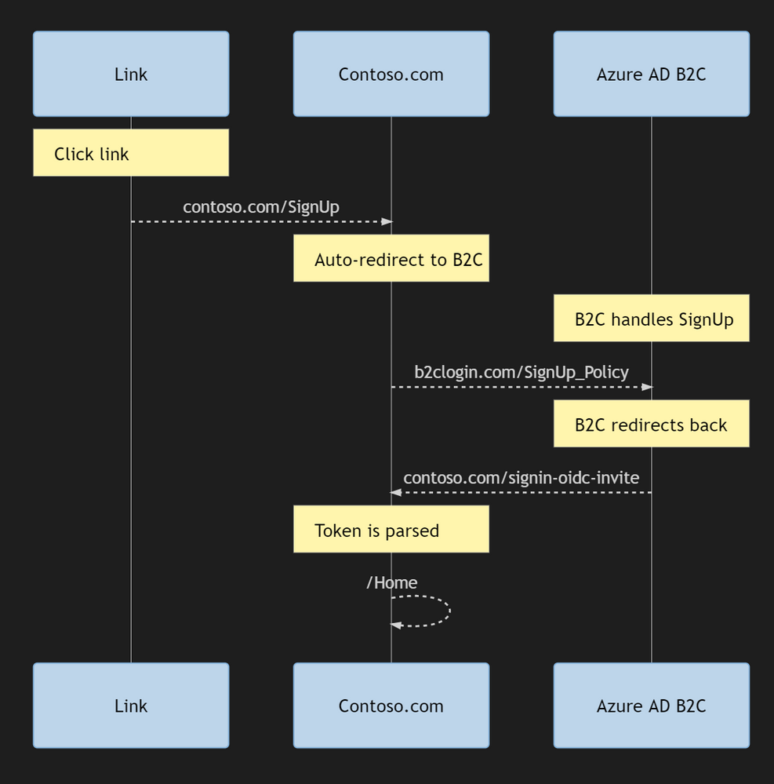

# Sign-in with a magic link

This sample demonstrates how to sign-in to a web application by sending a sign-in link. On the sign-up or sign-in page, user click on sign-in wiht **magic link**. Azure AD B2C calls a REST API that sends an email to the end user with a link to sign-in policy. The link to the sign-in policy contains the email address, which is encapsulated inside a JWT token (id_token_hint). When a user clicks on that link, Azure AD B2C validates the JWT token signature, reads the information from the token, extracts the email address and issues an access token back to the application.

## User flow


To sign-in, from Azure AD B2C sign-up or sign-in page, user select to sign-in with **Magic link**. Then user types an **email address** and click **Continue**.


Azure AD B2C sends a sign-in link (with a id*token_hint) and present a message \_A link to sign-in has been sent to your inbox.*.


At this point user needs to open the email and click on the link, that takes to user to Azure AD B2C policy.


Azure AD B2C validate the input id_token_hint, issues an access token, and redirect the user back to the application.


## Sending Application Data

The key of sending data to Azure AD B2C custom policy is to package the data into a JWT token as claims (id_token_hint). In this case, we send the user's email address to Azure B2C. Sending JWT token requires to host the necessary metadata endpoints required to use the "id_token_hint" parameter in Azure AD B2C.

ID tokens are JSON Web Tokens (JWTs) and, in this application, are signed using RSA certificates. This application hosts an Open ID Connect metatdata endpoint and JSON Web Keys (JWKs) endpoint which are used by Azure AD B2C to validate the signature of the ID token.

The web app has following endpoints:

- **/.well-known/openid-configuration**, set this URL in the **IdTokenHint_ExtractClaims** technical profile
- **/.well-known/keys**

## Community Help and Support

Use [Stack Overflow](https://stackoverflow.com/questions/tagged/azure-ad-b2c) to get support from the community. Ask your questions on Stack Overflow first and browse existing issues to see if someone has asked your question before. Make sure that your questions or comments are tagged with [azure-ad-b2c].
If you find a bug in the sample, please raise the issue on [GitHub Issues](https://github.com/azure-ad-b2c/samples/issues).
To provide product feedback, visit the Azure Active Directory B2C [Feedback page](https://feedback.azure.com/forums/169401-azure-active-directory?category_id=160596).

### Creating a signing certificate

The sample application uses a self-signed certificate to sign the ID tokens. You can generate a valid self-signed certificate for this purpose and get the thumbprint using PowerShell _(note: Run as Administrator)_:

```Powershell
$cert = New-SelfSignedCertificate -Type Custom -Subject "CN=MySelfSignedCertificate" -TextExtension @("2.5.29.37={text}1.3.6.1.5.5.7.3.3") -KeyUsage DigitalSignature -KeyAlgorithm RSA -KeyLength 2048 -NotAfter (Get-Date).AddYears(2) -CertStoreLocation "Cert:\CurrentUser\My"
$cert.Thumbprint
```

Export the certificate as a pfx-file and hop on over to the B2C part of the Azure Portal.

(Copying Microsoft's instructions)

In the "Policy Keys" blade, Click Add to create a new key and select Upload in the options.

Give it a name, something like Id_Token_Hint_Cert and select key type to be RSA and usage to be Signature. You can optionally set the expiration to the expiration date of the cert. Save the name of the generated key.
Create a dummy set of new base, extension and relying party files. You can do so by downloading it from the starter pack here:
https://github.com/Azure-Samples/active-directory-b2c-custom-policy-starterpack.

To keep things simple we will use
https://github.com/Azure-Samples/active-directory-b2c-custom-policy-starterpack/tree/master/LocalAcc... but any starter pack can be used. (Suffix these with \_DUMMY or something so you don't mix them with actual policies.)

Once you have successfully setup the new starter pack policies open the base file of this set and update the TechnicalProfile Id="JwtIssuer" Here we will update the token signing key container to the key we created.

Update B2C_1A_TokenSigningKeyContainer to B2C_1A_Id_Token_Hint_Cert like this:

<Key Id="issuer_secret" StorageReferenceId="B2C_1A_Id_Token_Hint_Cert" />

### Configuring the application

Update the _appSettings_ values in **appsettings.json** with the information for your Azure AD B2C tenant and the signing certificate you just created.

- **B2CTenant**: Your Azure AD B2C tenant name (without _.onmicrosoft.com_)
- **B2CPolicy**: The policy which you'd like to send the id_token_hint
- **B2CClientId**: The application ID for the Azure AD B2C app you'd like to redirect to
- **B2CRedirectUri**: The target redirect URI for your application
- **B2CSignUpUrl** the link to B2C format
- **SigningCertThumbprint**: The thumbprint for the signing certificate you just created
- **SigningCertAlgorithm**: The certificate algorithm (must be an RSA algorithm)
- **LinkExpiresAfterMinutes**: Link expiration (in minutes)
- **SMTPServer**: Your SMTP server
- **SMTPPort**: Your SMTP server port number
- **SMTPUsername**: SMTP user name, if necessary
- **SMTPPassword**: SMTP password, if necessary
- **SMTPUseSSL**: SMTP use SSL, true of false
- **SMTPFromAddress**: Send from email address
- **SMTPSubject**: The invitation email's subject

### Creating B2C mailer

Sending the emails are a matter of calling into a REST API which can be done any number of ways. To simplify things SendGrid has NuGet packages for use with C#, and in this case there are a couple of additional lines of code needed for generating the token and url. If you want to do a script-based version or a web page is sort of up to you.

```csharp
using SendGrid;
using SendGrid.Helpers.Mail;
using System.Net;
using TMF.MagicLinks.API.DTO;

namespace TMF.MagicLinks.API.Infrastructure
{
    public class MailDeliveryService
    {
        private readonly ISendGridClient _sendGridClient;
        private readonly IConfiguration _configuration;

        public MailDeliveryService(ISendGridClient sendGridClient,
                                   IConfiguration configuration)
        {
            _sendGridClient = sendGridClient;
            _configuration = configuration;
        }

        public async Task SendInvitationMessageAsync(EmailContentWithMagicLink userMailInvitation)
        {
            string fromEmailAddress = _configuration
                  .GetSection("SendGridConfiguration")["FromEmail"];
            string toEmailAddress = userMailInvitation.ToEmail;
            string mailTemplateId = _configuration
                  .GetSection("SendGridConfiguration")["MailTemplateId"];


            var emailMessage = MailHelper.CreateSingleTemplateEmail(
                 new EmailAddress(fromEmailAddress),
                 new EmailAddress(toEmailAddress),
                 mailTemplateId,
                 new
                 {
                     magicLink = userMailInvitation.LoginMagicLink
                 });

            var response = await _sendGridClient.SendEmailAsync(emailMessage);
            if (response.StatusCode != HttpStatusCode.Accepted)
            {
                var responseContent = await response.Body.ReadAsStringAsync();
                throw new Exception($"SendGrid service returned status code {response.StatusCode}" +
                                    $" with response: {responseContent}");
            }
        }
    }
}
```

### Running the application

When you run the application, you'll be able to enter the email of a user. When you click on **Send sign-in email**, the app sends a sign-in email to the account you specified.

To inspect the generated token, copy and paste it into a tool like [JWT.ms](htttps://jwt.ms).

### Hosting the application in Azure App Service

If you publish the application to Azure App Service, you'll need to configure a valid certificate with a private key in Azure App Service.

1. Export your certificate as a PFX file using the User Certificates management tool (or create a new one).
2. Upload your certificate in the **Private Certificates** tab of the **SSL Settings** blade of your Azure App Service.
3. [Ensure App Service loads the certificate](https://docs.microsoft.com/en-us/azure/app-service/app-service-web-ssl-cert-load#load-your-certificates) when the app runs.

## Adapting an MVC web page

Thing is - while this would prove the setup is correct this doesn't plug into your regular templatized .NET Core web app. When you build your app based on the templates in Visual Studio and enable OpenID Connect-based authentication a couple of things is configured in the background for you to make it work more or less automatically.

If your app is running at https://foo.bar a SignIn action will take you to https://contoso.b2clogin.com/xyz, and once you have logged in B2C will send your browser session back to https://foo.bar/signin-oidc.

You might think that this means that you can just make the magic link send you directly to B2C and include the corresponding return url, but what will happen is that the app running at https://foo.bar will recognize that it didn't initiate the request and basically says "I don't trust this". (Auth endpoints are different than API endpoints so it's not just a matter of accepting a token.)

So the flow basically becomes something like this:



For a Production scenario, the link containing the the id_token_hint should point to your application, https://myapp.com/redeem?hint=<id_token_hint value>. The application should have a valid route to handle a query parameter contatining the id_token_hint. The App should then use the authentication library to start an authentication to the AAD B2C Policy Id for which this id_token_hint is due to be consumed at. The library will contain a method to add query parameters to the authentication request. See the docuementation for the library in use to implement this.

The authentication library will then build the final authentication link, with the id_token_hint appended as part of a query parameter. This will now be a valid authentication request and your user will be redirected to the Azure AD B2C policy from your Application. Your application will be able to handle the response from Azure AD B2C properly.

To implement this requirement I did the following:

Generated the link containing the the id_token_hint in the API

```csharp
using TMF.MagicLinks.API.DTO;

namespace TMF.MagicLinks.API.Infrastructure
{
    public class UserMagicLinkInvitationHandler
    {
        private readonly IdTokenHintBuilder _idTokenHintBuilder;
        private readonly MailDeliveryService _mailDeliveryService;
        private readonly IConfiguration _configuration;

        public UserMagicLinkInvitationHandler(IdTokenHintBuilder idTokenHintBuilder,
                                          MailDeliveryService mailDeliveryService,
                                          IConfiguration configuration)
        {
            _idTokenHintBuilder = idTokenHintBuilder;
            _mailDeliveryService = mailDeliveryService;
            _configuration = configuration;
        }

        public async Task SendEmailWithMagicLinkAsync(UserInputClaimsForMagicLink userInputClaimsForMagicLink)
        {
            var idTokenHint = _idTokenHintBuilder.BuildIdToken(userInputClaimsForMagicLink.Email);

            var redirectUrl = _configuration
                   .GetSection("UserMagicLinkInvitationConfiguration")["B2CRedirectUri"];

            var magicLinkLoginUrl = $"{redirectUrl}?id_token_hint={idTokenHint}";

            var emailContentWithMagicLink = new EmailContentWithMagicLink
            {
                LoginMagicLink = magicLinkLoginUrl,
                ToEmail = userInputClaimsForMagicLink.Email
            };

            await _mailDeliveryService.SendInvitationMessageAsync(emailContentWithMagicLink);
        }


        //IMPORTANT! This method will generate test magic link to redirect to jwt.ms site:
        public async Task SendEmailWithTestMagicLinkAsync(UserInputClaimsForMagicLink userInputClaimsForMagicLink)
        {
            var idTokenHint = _idTokenHintBuilder.BuildIdToken(userInputClaimsForMagicLink.Email);
            string nonce = Guid.NewGuid().ToString("n");

            var signInUrl = _configuration
                   .GetSection("UserMagicLinkInvitationConfiguration")["B2CSignInWithMagicLinkUrl"];
            var tenantName = _configuration
                   .GetSection("UserMagicLinkInvitationConfiguration")["B2CTenant"];
            var signInWithMagicLinkPolicy = _configuration
                   .GetSection("UserMagicLinkInvitationConfiguration")["B2CSignInWithMagicLinkPolicy"];
            var appClientId = _configuration
                   .GetSection("UserMagicLinkInvitationConfiguration")["B2CClientId"];
            var redirectUrl = "https://jwt.ms";

            var magicLinkLoginUrl = string.Format(signInUrl, tenantName,
                    signInWithMagicLinkPolicy,
                    appClientId,
                    Uri.EscapeDataString(redirectUrl),
                    nonce) + "&id_token_hint=" + idTokenHint;


            var emailContentWithMagicLink = new EmailContentWithMagicLink
            {
                LoginMagicLink = magicLinkLoginUrl,
                ToEmail = userInputClaimsForMagicLink.Email
            };

            await _mailDeliveryService.SendInvitationMessageAsync(emailContentWithMagicLink);
        }
    }
}
```

Impelemented a valid route to handle the query parameter contatining the id_token_hint in the ASPNET Web Application.

```csharp
using Microsoft.AspNetCore.Authentication;
using Microsoft.AspNetCore.Authorization;
using Microsoft.AspNetCore.Mvc;

namespace TMF.MagicLinks.WebApp.Controllers
{
    [AllowAnonymous]
    [Route("api/[controller]")]
    public class MagicLinksController : Controller
    {
        private readonly IConfiguration _configuration;
        public MagicLinksController(IConfiguration configuration)
        {
            _configuration = configuration;
        }

        [HttpGet("signin-oidc-link")]
        public IActionResult SignInLink([FromQuery] string id_token_hint)
        {
            var magic_link_auth = new AuthenticationProperties { RedirectUri = "/" };
            magic_link_auth.Items.Add("id_token_hint", id_token_hint);

            string magic_link_policy = _configuration.GetSection("AzureAdB2CConfiguration")["MagicLinksPolicyId"];
            return Challenge(magic_link_auth, magic_link_policy);
        }
    }
}

```

## Notes

This sample policy is based on [SocialAndLocalAccounts starter pack](https://github.com/Azure-Samples/active-directory-b2c-custom-policy-starterpack/tree/master/SocialAndLocalAccounts). All changes are marked with **Sample:** comment inside the policy XML files. Make the necessary changes in the **Sample action required** sections.

We need an additional custom policies

1. B2C_1A_SignUp_SignIn_with_magic_link

```xml
<?xml version="1.0" encoding="UTF-8" standalone="yes"?>
<TrustFrameworkPolicy
  xmlns:xsi="http://www.w3.org/2001/XMLSchema-instance"
  xmlns:xsd="http://www.w3.org/2001/XMLSchema"
  xmlns="http://schemas.microsoft.com/online/cpim/schemas/2013/06"
  PolicySchemaVersion="0.3.0.0"
  TenantId="yourtenant.onmicrosoft.com"
  PolicyId="B2C_1A_SignUp_SignIn_with_magic_link"
  PublicPolicyUri="http://bundilabsb2c.onmicrosoft.com/B2C_1A_SignUp_SignIn_with_magic_link">

  <BasePolicy>
    <TenantId>yourtenant.onmicrosoft.com</TenantId>
    <PolicyId>B2C_1A_TrustFrameworkExtensions</PolicyId>
  </BasePolicy>
  <BuildingBlocks>
    <ClaimsSchema>
      <!--Sample: indicating that magic link sent to the user -->
      <ClaimType Id="magicLinkSent">
      	<DisplayName>magicLinkSent</DisplayName>
      	<DataType>boolean</DataType>
      </ClaimType>

      <!--Sample: Stores the message that an email sent to you-->
      <ClaimType Id="userMessage">
     	  <DisplayName></DisplayName>
     	  <DataType>string</DataType>
        <UserHelpText>Add help text here</UserHelpText>
     	  <UserInputType>Paragraph</UserInputType>
      </ClaimType>
    </ClaimsSchema>

    <ClaimsTransformations>
      <!--Sample: Initiates the message to be presented to the user-->
      <ClaimsTransformation Id="CreateUserMessage" TransformationMethod="CreateStringClaim">
        <InputParameters>
          <InputParameter Id="value" DataType="string" Value="A link to sign-in has been sent to your inbox." />
        </InputParameters>
        <OutputClaims>
          <OutputClaim ClaimTypeReferenceId="userMessage" TransformationClaimType="createdClaim" />
        </OutputClaims>
      </ClaimsTransformation>
    </ClaimsTransformations>
  </BuildingBlocks>


<ClaimsProviders>
  <ClaimsProvider>
    <DisplayName>Local Account</DisplayName>
    <TechnicalProfiles>
      <!--Sample: This technical profile collect the email address, and call a validation technical profile
        to send the magic link to the provided email address-->
      <TechnicalProfile Id="SelfAsserted-LocalAccountSignin-MagicLink">
          <DisplayName>Magic link</DisplayName>
          <Protocol Name="Proprietary" Handler="Web.TPEngine.Providers.SelfAssertedAttributeProvider, Web.TPEngine, Version=1.0.0.0, Culture=neutral, PublicKeyToken=null"/>
          <Metadata>
            <Item Key="ContentDefinitionReferenceId">api.selfasserted</Item>
          </Metadata>
          <OutputClaims>
            <OutputClaim ClaimTypeReferenceId="email" Required="true"/>
            <OutputClaim ClaimTypeReferenceId="magicLinkSent" />
          </OutputClaims>
          <OutputClaimsTransformations>
             <OutputClaimsTransformation ReferenceId="CreateUserMessage" />
          </OutputClaimsTransformations>
          <ValidationTechnicalProfiles>
            <ValidationTechnicalProfile ReferenceId="REST-SendMacigLink"/>
          </ValidationTechnicalProfiles>
          <UseTechnicalProfileForSessionManagement ReferenceId="SM-AAD"/>
        </TechnicalProfile>

        <!-- Demo: Show email sent message-->
        <TechnicalProfile Id="SelfAsserted-EmailSent">
          <DisplayName>Sing-in with local account</DisplayName>
          <Protocol Name="Proprietary" Handler="Web.TPEngine.Providers.SelfAssertedAttributeProvider, Web.TPEngine, Version=1.0.0.0, Culture=neutral, PublicKeyToken=null"/>
          <Metadata>
            <Item Key="ContentDefinitionReferenceId">api.selfasserted</Item>
            <!-- Sample: Remove the continue and cancel button-->
            <Item Key="setting.showContinueButton">false</Item>
            <Item Key="setting.showCancelButton">false</Item>
         </Metadata>
          <InputClaims>
            <InputClaim ClaimTypeReferenceId="userMessage"/>
          </InputClaims>
          <OutputClaims>
            <OutputClaim ClaimTypeReferenceId="userMessage"/>
          </OutputClaims>
        </TechnicalProfile>
      </TechnicalProfiles>
    </ClaimsProvider>

    <!--Sample: This technical profile sends a magic link to the provided email address-->
    <ClaimsProvider>
      <DisplayName>Custom REST API</DisplayName>
      <TechnicalProfiles>
        <TechnicalProfile Id="REST-SendMacigLink">
          <DisplayName>Send a magic link</DisplayName>
          <Protocol Name="Proprietary" Handler="Web.TPEngine.Providers.RestfulProvider, Web.TPEngine, Version=1.0.0.0, Culture=neutral, PublicKeyToken=null" />
          <Metadata>
            <!--Sample action required: replace with your endpoint location -->
            <Item Key="ServiceUrl">https://azureb2cmagiclinksapp.azurewebsites.net/api/identity</Item>
            <Item Key="AuthenticationType">None</Item>
            <Item Key="AllowInsecureAuthInProduction">true</Item>
            <Item Key="SendClaimsIn">Body</Item>
          </Metadata>
          <InputClaims>
            <InputClaim ClaimTypeReferenceId="email" />
          </InputClaims>
          <OutputClaims>
            <OutputClaim ClaimTypeReferenceId="magicLinkSent" DefaultValue="true" AlwaysUseDefaultValue="true"/>
          </OutputClaims>
          <UseTechnicalProfileForSessionManagement ReferenceId="SM-Noop" />
        </TechnicalProfile>
      </TechnicalProfiles>
    </ClaimsProvider>

  </ClaimsProviders>
<UserJourneys>
  <UserJourney Id="SignUpOrSignInWithMagicLink">
      <OrchestrationSteps>

        <OrchestrationStep Order="1" Type="CombinedSignInAndSignUp" ContentDefinitionReferenceId="api.signuporsignin">
          <ClaimsProviderSelections>
            <ClaimsProviderSelection TargetClaimsExchangeId="FacebookExchange"/>
            <!--Sample: Adding the sign-in with magic link button-->
            <ClaimsProviderSelection TargetClaimsExchangeId="SignInWithMagicLinkExchange"/>
            <ClaimsProviderSelection ValidationClaimsExchangeId="LocalAccountSigninEmailExchange"/>
          </ClaimsProviderSelections>
          <ClaimsExchanges>
            <ClaimsExchange Id="LocalAccountSigninEmailExchange" TechnicalProfileReferenceId="SelfAsserted-LocalAccountSignin-Email"/>
          </ClaimsExchanges>
        </OrchestrationStep>

        <!-- Check if the user has selected to sign in using one of the social providers -->
        <OrchestrationStep Order="2" Type="ClaimsExchange">
          <Preconditions>
            <Precondition Type="ClaimsExist" ExecuteActionsIf="true">
              <Value>objectId</Value>
              <Action>SkipThisOrchestrationStep</Action>
            </Precondition>
          </Preconditions>
          <ClaimsExchanges>
            <ClaimsExchange Id="FacebookExchange" TechnicalProfileReferenceId="Facebook-OAUTH"/>
            <ClaimsExchange Id="SignInWithMagicLinkExchange" TechnicalProfileReferenceId="SelfAsserted-LocalAccountSignin-MagicLink"/>
            <ClaimsExchange Id="SignUpWithLogonEmailExchange" TechnicalProfileReferenceId="LocalAccountSignUpWithLogonEmail"/>
          </ClaimsExchanges>
        </OrchestrationStep>

        <!-- Sample: If user choose to sign-in with magic email, stop the flow. -->
        <OrchestrationStep Order="3" Type="ClaimsExchange">
          <Preconditions>
            <Precondition Type="ClaimsExist" ExecuteActionsIf="false">
              <Value>magicLinkSent</Value>
              <Action>SkipThisOrchestrationStep</Action>
            </Precondition>
          </Preconditions>
          <ClaimsExchanges>
            <ClaimsExchange Id="SelfAssertedEmailSent" TechnicalProfileReferenceId="SelfAsserted-EmailSent"/>
          </ClaimsExchanges>
        </OrchestrationStep>

        <!-- For social IDP authentication, attempt to find the user account in the directory. -->
        <OrchestrationStep Order="4" Type="ClaimsExchange">
          <Preconditions>
            <Precondition Type="ClaimEquals" ExecuteActionsIf="true">
              <Value>authenticationSource</Value>
              <Value>localAccountAuthentication</Value>
              <Action>SkipThisOrchestrationStep</Action>
            </Precondition>
          </Preconditions>
          <ClaimsExchanges>
            <ClaimsExchange Id="AADUserReadUsingAlternativeSecurityId" TechnicalProfileReferenceId="AAD-UserReadUsingAlternativeSecurityId-NoError"/>
          </ClaimsExchanges>
        </OrchestrationStep>

        <!-- Show self-asserted page only if the directory does not have the user account already (i.e. we do not have an objectId).
          This can only happen when authentication happened using a social IDP. If local account was created or authentication done
          using ESTS in step 2, then an user account must exist in the directory by this time. -->
        <OrchestrationStep Order="5" Type="ClaimsExchange">
          <Preconditions>
            <Precondition Type="ClaimsExist" ExecuteActionsIf="true">
              <Value>objectId</Value>
              <Action>SkipThisOrchestrationStep</Action>
            </Precondition>
          </Preconditions>
          <ClaimsExchanges>
            <ClaimsExchange Id="SelfAsserted-Social" TechnicalProfileReferenceId="SelfAsserted-Social"/>
          </ClaimsExchanges>
        </OrchestrationStep>

        <!-- This step reads any user attributes that we may not have received when authenticating using ESTS so they can be sent
          in the token. -->
        <OrchestrationStep Order="6" Type="ClaimsExchange">
          <Preconditions>
            <Precondition Type="ClaimEquals" ExecuteActionsIf="true">
              <Value>authenticationSource</Value>
              <Value>socialIdpAuthentication</Value>
              <Action>SkipThisOrchestrationStep</Action>
            </Precondition>
          </Preconditions>
          <ClaimsExchanges>
            <ClaimsExchange Id="AADUserReadWithObjectId" TechnicalProfileReferenceId="AAD-UserReadUsingObjectId"/>
          </ClaimsExchanges>
        </OrchestrationStep>
        <!-- The previous step (SelfAsserted-Social) could have been skipped if there were no attributes to collect
             from the user. So, in that case, create the user in the directory if one does not already exist
             (verified using objectId which would be set from the last step if account was created in the directory. -->
        <OrchestrationStep Order="7" Type="ClaimsExchange">
          <Preconditions>
            <Precondition Type="ClaimsExist" ExecuteActionsIf="true">
              <Value>objectId</Value>
              <Action>SkipThisOrchestrationStep</Action>
            </Precondition>
          </Preconditions>
          <ClaimsExchanges>
            <ClaimsExchange Id="AADUserWrite" TechnicalProfileReferenceId="AAD-UserWriteUsingAlternativeSecurityId"/>
          </ClaimsExchanges>
        </OrchestrationStep>

        <OrchestrationStep Order="8" Type="SendClaims" CpimIssuerTechnicalProfileReferenceId="JwtIssuer"/>

      </OrchestrationSteps>
      <ClientDefinition ReferenceId="DefaultWeb"/>
    </UserJourney>
  </UserJourneys>
  <RelyingParty>
    <DefaultUserJourney ReferenceId="SignUpOrSignInWithMagicLink" />
    <TechnicalProfile Id="PolicyProfile">
      <DisplayName>PolicyProfile</DisplayName>
      <Protocol Name="OpenIdConnect" />
      <OutputClaims>
        <OutputClaim ClaimTypeReferenceId="displayName" />
        <OutputClaim ClaimTypeReferenceId="givenName" />
        <OutputClaim ClaimTypeReferenceId="surname" />
        <OutputClaim ClaimTypeReferenceId="email" />
        <OutputClaim ClaimTypeReferenceId="objectId" PartnerClaimType="sub"/>
        <OutputClaim ClaimTypeReferenceId="tenantId" AlwaysUseDefaultValue="true" DefaultValue="{Policy:TenantObjectId}" />
      </OutputClaims>
      <SubjectNamingInfo ClaimType="sub" />
    </TechnicalProfile>
  </RelyingParty>
</TrustFrameworkPolicy>

```

2. B2C_1A_SignUp_SignIn_with_magic_link

```xml
<?xml version="1.0" encoding="UTF-8" standalone="yes"?>
<TrustFrameworkPolicy
  xmlns:xsi="http://www.w3.org/2001/XMLSchema-instance"
  xmlns:xsd="http://www.w3.org/2001/XMLSchema"
  xmlns="http://schemas.microsoft.com/online/cpim/schemas/2013/06"
  PolicySchemaVersion="0.3.0.0"
  TenantId="yourtenant.onmicrosoft.com"
  PolicyId="B2C_1A_signin_with_magic_link"
  PublicPolicyUri="http://bundilabsb2c.onmicrosoft.com/B2C_1A_signin_with_email">

  <BasePolicy>
    <TenantId>yourtenant.onmicrosoft.com</TenantId>
    <PolicyId>B2C_1A_TrustFrameworkExtensions</PolicyId>
  </BasePolicy>

   <BuildingBlocks>
    <ClaimsSchema>
      <!--Sample: Stores the error message for unsolicited request (a request without id_token_hint) and user not found-->
      <ClaimType Id="errorMessage">
     	  <DisplayName>Error</DisplayName>
     	  <DataType>string</DataType>
        <UserHelpText>Add help text here</UserHelpText>
     	  <UserInputType>Paragraph</UserInputType>
      </ClaimType>
    </ClaimsSchema>

    <ClaimsTransformations>
      <!--Sample: Initiates the errorMessage claims type with the error message-->
      <ClaimsTransformation Id="CreateUnsolicitedErrorMessage" TransformationMethod="CreateStringClaim">
        <InputParameters>
          <InputParameter Id="value" DataType="string" Value="You cannot sign-in without invitation" />
        </InputParameters>
        <OutputClaims>
          <OutputClaim ClaimTypeReferenceId="errorMessage" TransformationClaimType="createdClaim" />
        </OutputClaims>
      </ClaimsTransformation>

      <!--Sample: Initiates the errorMessage claims type with the error message user not found-->
      <ClaimsTransformation Id="CreateUserNotFoundErrorMessage" TransformationMethod="CreateStringClaim">
        <InputParameters>
          <InputParameter Id="value" DataType="string" Value="You aren't registered in the system!" />
        </InputParameters>
        <OutputClaims>
          <OutputClaim ClaimTypeReferenceId="errorMessage" TransformationClaimType="createdClaim" />
        </OutputClaims>
      </ClaimsTransformation>
    </ClaimsTransformations>
  </BuildingBlocks>


  <ClaimsProviders>
    <!--Sample: This technical profile specifies how B2C should validate your token, and what claims you want B2C to extract from the token.
      The METADATA value in the TechnicalProfile meta-data is required.
      The “IdTokenAudience” and “issuer” arguments are optional (see later section)-->
    <ClaimsProvider>
      <DisplayName>My ID Token Hint ClaimsProvider</DisplayName>
      <TechnicalProfiles>
        <TechnicalProfile Id="IdTokenHint_ExtractClaims">
          <DisplayName> My ID Token Hint TechnicalProfile</DisplayName>
          <Protocol Name="None" />
          <Metadata>

            <!--Sample action required: replace with your endpoint location -->
            <Item Key="METADATA">https://azureb2cmagiclinksapp.azurewebsites.net/.well-known/openid-configuration</Item>

            <!-- <Item Key="IdTokenAudience">your_optional_audience_override</Item> -->
            <!-- <Item Key="issuer">your_optional_token_issuer_override</Item> -->
          </Metadata>
        <OutputClaims>
          <!--Sample: Read the email cliam from the id_token_hint-->
          <OutputClaim ClaimTypeReferenceId="email" />
        </OutputClaims>
        </TechnicalProfile>
      </TechnicalProfiles>
    </ClaimsProvider>

    <ClaimsProvider>
      <DisplayName>Self Asserted</DisplayName>
      <TechnicalProfiles>
        <!-- Demo: Show error message-->
        <TechnicalProfile Id="SelfAsserted-Error">
          <DisplayName>Unsolicited error message</DisplayName>
          <Protocol Name="Proprietary" Handler="Web.TPEngine.Providers.SelfAssertedAttributeProvider, Web.TPEngine, Version=1.0.0.0, Culture=neutral, PublicKeyToken=null"/>
          <Metadata>
            <Item Key="ContentDefinitionReferenceId">api.selfasserted</Item>
            <!-- Sample: Remove the continue button-->
            <Item Key="setting.showContinueButton">false</Item>
         </Metadata>
          <InputClaims>
            <InputClaim ClaimTypeReferenceId="errorMessage"/>
          </InputClaims>
          <OutputClaims>
            <OutputClaim ClaimTypeReferenceId="errorMessage"/>
          </OutputClaims>
        </TechnicalProfile>

        <!-- Demo: Show unsolicited error message-->
        <TechnicalProfile Id="SelfAsserted-Unsolicited">
          <InputClaimsTransformations>
            <InputClaimsTransformation ReferenceId="CreateUnsolicitedErrorMessage" />
          </InputClaimsTransformations>
          <IncludeTechnicalProfile ReferenceId="SelfAsserted-Error" />
        </TechnicalProfile>

        <!-- Demo: Show user not found error message-->
        <TechnicalProfile Id="SelfAsserted-UserNotFound">
          <InputClaimsTransformations>
            <InputClaimsTransformation ReferenceId="CreateUserNotFoundErrorMessage" />
          </InputClaimsTransformations>
          <IncludeTechnicalProfile ReferenceId="SelfAsserted-Error" />
        </TechnicalProfile>
      </TechnicalProfiles>
    </ClaimsProvider>

    <ClaimsProvider>
      <DisplayName>Azure Active Directory</DisplayName>
      <TechnicalProfiles>
        <TechnicalProfile Id="AAD-UserReadUsingEmailAddress">
          <Metadata>
            <!--Sample: don't raise error if user not found. We have an orchestration step to handle the error message-->
            <Item Key="RaiseErrorIfClaimsPrincipalDoesNotExist">false</Item>
          </Metadata>
          <OutputClaims>
            <!--Sample: add optional claims to read from the directory-->
            <OutputClaim ClaimTypeReferenceId="givenName"/>
            <OutputClaim ClaimTypeReferenceId="surname"/>
          </OutputClaims>
        </TechnicalProfile>
      </TechnicalProfiles>
    </ClaimsProvider>
  </ClaimsProviders>

  <UserJourneys>
    <UserJourney Id="SignUpOrSignInWithEmail">
      <OrchestrationSteps>

        <!--Sample: Read the input claims from the id_token_hint-->
        <OrchestrationStep Order="1" Type="GetClaims" CpimIssuerTechnicalProfileReferenceId="IdTokenHint_ExtractClaims" />

        <!-- Sample: Check if user tries to run the policy without invitation -->
        <OrchestrationStep Order="2" Type="ClaimsExchange">
         <Preconditions>
            <Precondition Type="ClaimsExist" ExecuteActionsIf="true">
              <Value>email</Value>
              <Action>SkipThisOrchestrationStep</Action>
            </Precondition>
          </Preconditions>
          <ClaimsExchanges>
            <ClaimsExchange Id="SelfAsserted-Unsolicited" TechnicalProfileReferenceId="SelfAsserted-Unsolicited" />
          </ClaimsExchanges>
        </OrchestrationStep>

        <!--Sample: Read the user properties from the directory-->
        <OrchestrationStep Order="3" Type="ClaimsExchange">
          <ClaimsExchanges>
            <ClaimsExchange Id="AADUserReadUsingEmailAddress" TechnicalProfileReferenceId="AAD-UserReadUsingEmailAddress"/>
          </ClaimsExchanges>
        </OrchestrationStep>

        <!-- Sample: Check whether the user not existed in the directory -->
        <OrchestrationStep Order="4" Type="ClaimsExchange">
          <Preconditions>
            <Precondition Type="ClaimsExist" ExecuteActionsIf="true">
              <Value>objectId</Value>
              <Action>SkipThisOrchestrationStep</Action>
            </Precondition>
          </Preconditions>
          <ClaimsExchanges>
            <ClaimsExchange Id="SelfAssertedUserNotFound" TechnicalProfileReferenceId="SelfAsserted-UserNotFound" />
          </ClaimsExchanges>
        </OrchestrationStep>

        <!--Sample: Issue an access token-->
        <OrchestrationStep Order="5" Type="SendClaims" CpimIssuerTechnicalProfileReferenceId="JwtIssuer"/>

      </OrchestrationSteps>
      <ClientDefinition ReferenceId="DefaultWeb"/>
    </UserJourney>
  </UserJourneys>


  <RelyingParty>
    <DefaultUserJourney ReferenceId="SignUpOrSignInWithEmail" />
    <TechnicalProfile Id="PolicyProfile">
      <DisplayName>PolicyProfile</DisplayName>
      <Protocol Name="OpenIdConnect" />
      <!--Sample: Set the input claims to be read from the id_token_hint-->
      <InputClaims>
        <InputClaim ClaimTypeReferenceId="email" />
      </InputClaims>
      <OutputClaims>
        <OutputClaim ClaimTypeReferenceId="displayName" />
        <OutputClaim ClaimTypeReferenceId="givenName" />
        <OutputClaim ClaimTypeReferenceId="surname" />
        <OutputClaim ClaimTypeReferenceId="email" />
        <OutputClaim ClaimTypeReferenceId="objectId" PartnerClaimType="sub"/>
        <OutputClaim ClaimTypeReferenceId="tenantId" AlwaysUseDefaultValue="true" DefaultValue="{Policy:TenantObjectId}" />
      </OutputClaims>
      <SubjectNamingInfo ClaimType="sub" />
    </TechnicalProfile>
  </RelyingParty>
</TrustFrameworkPolicy>
```
