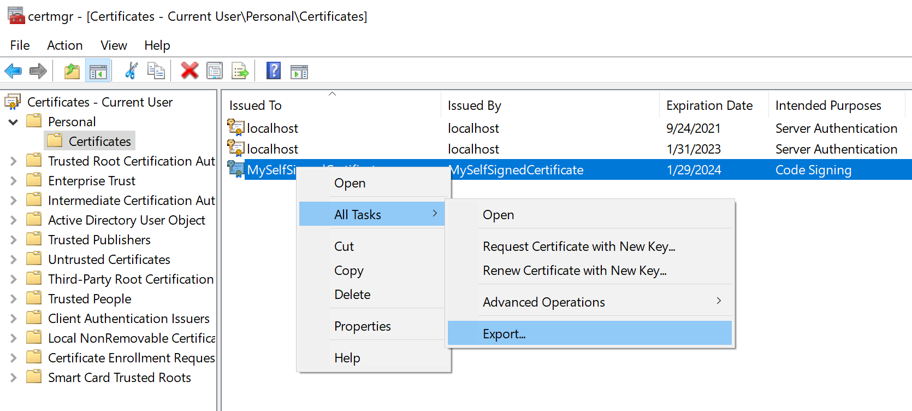
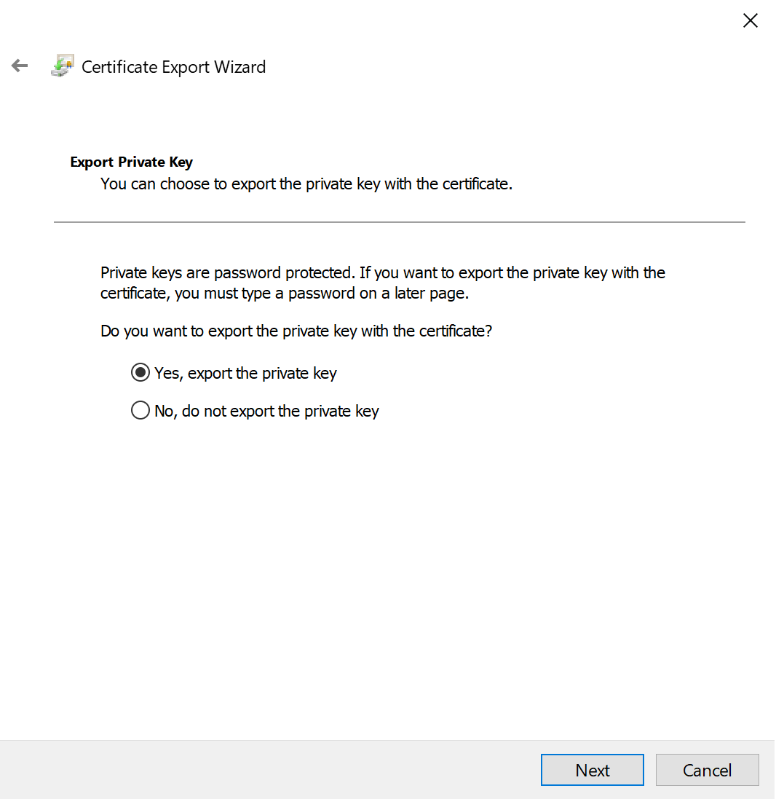
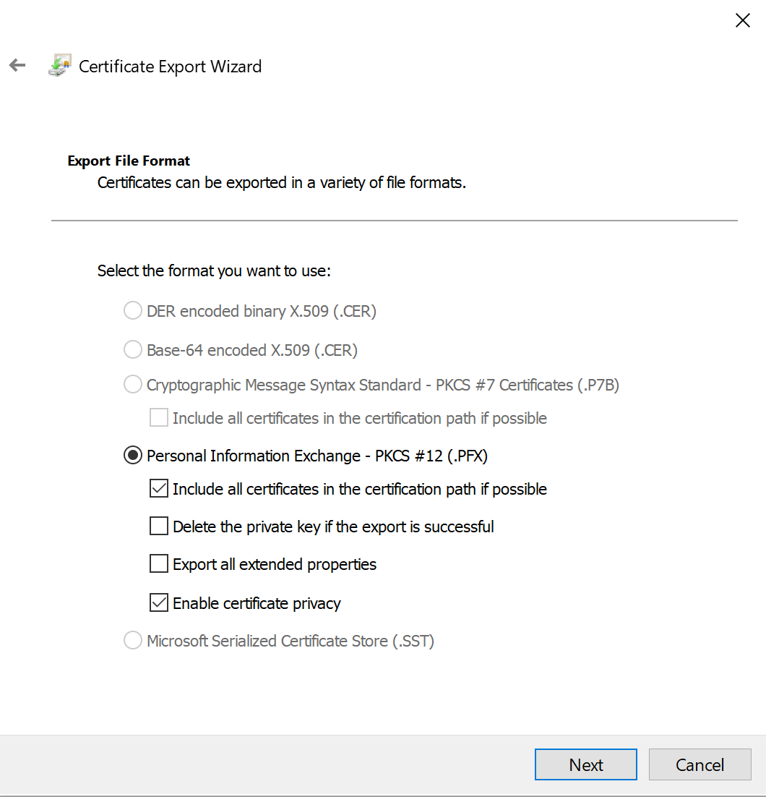
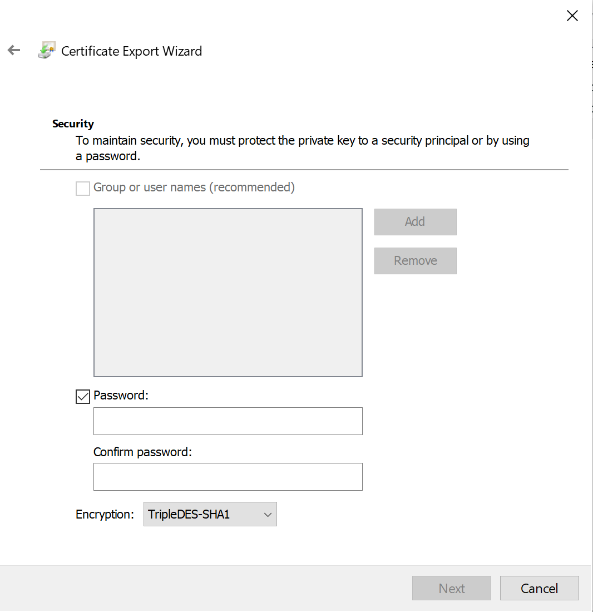

# Magic links with Azure AD B2C

This sample shows how to implement login with magic links with Azure AD B2C.


### Generate certificate

First, you will need to generate your own certificate which will be used to sign ID Token hints.

Here are helpful commands if you are on the Windows machine:

```powershell
$cert = New-SelfSignedCertificate -Type Custom -Subject "CN=MySelfSignedCertificate" -TextExtension @("2.5.29.37={text}1.3.6.1.5.5.7.3.3") -KeyUsage DigitalSignature -KeyAlgorithm RSA -KeyLength 2048 -NotAfter (Get-Date).AddYears(2) -CertStoreLocation "Cert:\CurrentUser\My"

$cert.Thumbprint
```

Above commands will generate certificate and show certificate thumbprint.

Here are helpful steps to export pfx certificate with password. Open "user certificates" (search it in the system), and follow below steps to export it:







